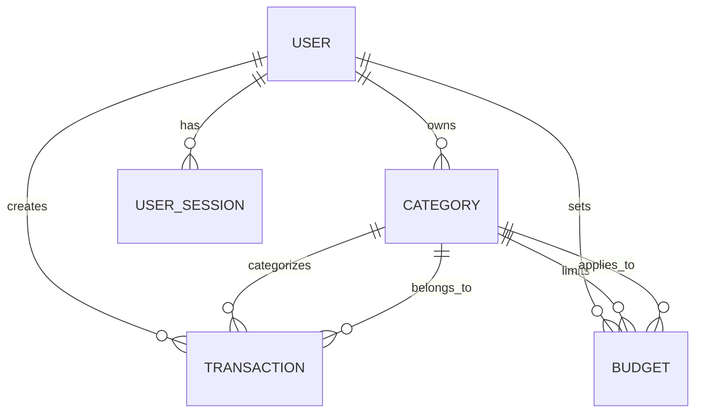

# ExpenseTracker - Resumen del Esquema de Base de Datos

## 📋 Información General

**Sistema:** ExpenseTracker - Gestor de Gastos Personales  
**Motor de Base de Datos:** PostgreSQL 14+  
**Sistema de Migraciones:** Flyway  
**Versión del Esquema:** 3.0  
**Última actualización:** Octubre 2024

---

## 🎯 Propósito del Esquema

Este esquema de base de datos está diseñado para soportar un sistema completo de gestión de gastos personales, permitiendo a los usuarios:

- Registrar y categorizar transacciones financieras (ingresos y gastos)
- Establecer y monitorear presupuestos por categoría
- Gestionar sesiones de usuario de forma segura
- Analizar patrones de gasto a lo largo del tiempo

---

## 📊 Diagrama de Relaciones

---

## 🗄️ Tablas del Sistema

### 1. **users** - Usuarios del Sistema

**Propósito:** Almacena información de autenticación y perfil de usuarios registrados.

| Columna | Tipo | Descripción |
|---------|------|-------------|
| `id` | BIGSERIAL | Identificador único (PK) |
| `email` | VARCHAR(100) | Email único para login |
| `username` | VARCHAR(100) | Nombre de usuario único |
| `password_hash` | VARCHAR(255) | Contraseña hasheada con BCrypt |
| `first_name` | VARCHAR(100) | Nombre del usuario |
| `last_name` | VARCHAR(100) | Apellido del usuario |
| `currency` | VARCHAR(3) | Código de moneda ISO 4217 (USD, COP, EUR) |
| `created_at` | TIMESTAMP | Fecha de registro |
| `updated_at` | TIMESTAMP | Última modificación |
| `active` | BOOLEAN | Estado del usuario |

**Índices:**
- `idx_users_email` (UNIQUE) - Optimiza login
- `idx_users_username` - Búsqueda por username
- `idx_users_active` - Filtrado de usuarios activos

---

### 2. **categories** - Categorías de Transacciones

**Propósito:** Clasificación personalizada de transacciones para organización y análisis.

| Columna | Tipo | Descripción |
|---------|------|-------------|
| `id` | BIGSERIAL | Identificador único (PK) |
| `user_id` | BIGINT | Referencia al usuario propietario (FK) |
| `name` | VARCHAR(100) | Nombre de la categoría |
| `description` | VARCHAR(255) | Descripción opcional |
| `color` | VARCHAR(7) | Color hexadecimal para UI (#FF6384) |
| `icon` | VARCHAR(50) | Nombre del icono Material-UI |
| `is_default` | BOOLEAN | Indica si es categoría del sistema |
| `created_at` | TIMESTAMP | Fecha de creación |
| `updated_at` | TIMESTAMP | Última modificación |
| `active` | BOOLEAN | Estado de la categoría |

**Constraints:**
- UNIQUE en `(user_id, name)` - Evita duplicados
- CHECK en `color` - Valida formato hexadecimal

**Índices:**
- `idx_categories_user_id` - Categorías por usuario
- `idx_categories_user_active` - Categorías activas

---

### 3. **transactions** - Transacciones Financieras

**Propósito:** Registro detallado de cada ingreso y gasto del usuario.

| Columna | Tipo | Descripción |
|---------|------|-------------|
| `id` | BIGSERIAL | Identificador único (PK) |
| `user_id` | BIGINT | Referencia al usuario (FK) |
| `category_id` | BIGINT | Referencia a la categoría (FK) |
| `amount` | DECIMAL(12,2) | Monto (+ ingreso, - gasto) |
| `description` | VARCHAR(255) | Descripción de la transacción |
| `transaction_date` | DATE | Fecha real de la transacción |
| `transaction_type` | ENUM | INCOME o EXPENSE |
| `payment_method` | ENUM | CASH, CARD, TRANSFER, OTHER |
| `notes` | VARCHAR(255) | Notas adicionales opcionales |
| `created_at` | TIMESTAMP | Fecha de registro |
| `updated_at` | TIMESTAMP | Última modificación |
| `active` | BOOLEAN | Estado (soft delete) |

**Constraints:**
- CHECK `amount != 0` - Monto no puede ser cero
- CHECK `transaction_date <= CURRENT_DATE` - No fechas futuras
- CHECK en consistencia entre `amount` y `transaction_type`

**Índices Principales:**
- `idx_transactions_user_date` - Historial por usuario
- `idx_transactions_user_category` - Filtros por categoría
- `idx_transactions_user_type` - Filtros por tipo

---

### 4. **budgets** - Presupuestos por Categoría

**Propósito:** Define límites de gasto mensuales por categoría y período.

| Columna | Tipo | Descripción |
|---------|------|-------------|
| `id` | BIGSERIAL | Identificador único (PK) |
| `user_id` | BIGINT | Referencia al usuario (FK) |
| `category_id` | BIGINT | Referencia a la categoría (FK) |
| `limit_amount` | DECIMAL(12,2) | Límite máximo de gasto |
| `month` | INT | Mes del presupuesto (1-12) |
| `year` | INT | Año del presupuesto |
| `spent_amount` | DECIMAL(12,2) | Monto gastado (calculado) |
| `alert_enabled` | BOOLEAN | Alertas habilitadas |
| `alert_threshold` | DECIMAL(5,2) | Umbral de alerta (0-100%) |
| `created_at` | TIMESTAMP | Fecha de creación |
| `updated_at` | TIMESTAMP | Última modificación |
| `active` | BOOLEAN | Estado del presupuesto |

**Constraints:**
- UNIQUE en `(user_id, category_id, month, year)`
- CHECK `limit_amount > 0`
- CHECK `month BETWEEN 1 AND 12`
- CHECK `alert_threshold BETWEEN 0 AND 100`

**Índices:**
- `idx_budgets_user_period` - Consultas por período
- `idx_budgets_alert` - Presupuestos cerca del límite

---

### 5. **user_sessions** - Sesiones de Usuario

**Propósito:** Gestión de sesiones activas y tokens JWT para autenticación.

| Columna | Tipo | Descripción |
|---------|------|-------------|
| `id` | BIGSERIAL | Identificador único (PK) |
| `user_id` | BIGINT | Referencia al usuario (FK) |
| `jwt_token` | VARCHAR(500) | Token JWT único |
| `expires_at` | TIMESTAMP | Fecha de expiración |
| `ip_address` | VARCHAR(45) | IP de origen |
| `user_agent` | VARCHAR(255) | Información del navegador |
| `created_at` | TIMESTAMP | Fecha de creación |
| `active` | BOOLEAN | Estado de la sesión |

**Constraints:**
- UNIQUE en `jwt_token`
- CHECK `expires_at > created_at`

**Índices:**
- `idx_user_sessions_token` (UNIQUE) - Validación rápida
- `idx_sessions_expired` - Limpieza de sesiones

---

## 🔗 Relaciones entre Tablas

### Relaciones One-to-Many (1:N)

1. **users → categories**
   - Un usuario puede tener múltiples categorías
   - FK: `categories.user_id` → `users.id`
   - ON DELETE: CASCADE (eliminar categorías al eliminar usuario)

2. **users → transactions**
   - Un usuario puede tener múltiples transacciones
   - FK: `transactions.user_id` → `users.id`
   - ON DELETE: RESTRICT (no eliminar si hay transacciones)

3. **users → budgets**
   - Un usuario puede tener múltiples presupuestos
   - FK: `budgets.user_id` → `users.id`
   - ON DELETE: CASCADE

4. **users → user_sessions**
   - Un usuario puede tener múltiples sesiones
   - FK: `user_sessions.user_id` → `users.id`
   - ON DELETE: CASCADE

5. **categories → transactions**
   - Una categoría puede tener múltiples transacciones
   - FK: `transactions.category_id` → `categories.id`
   - ON DELETE: RESTRICT

6. **categories → budgets**
   - Una categoría puede tener múltiples presupuestos
   - FK: `budgets.category_id` → `categories.id`
   - ON DELETE: CASCADE

---

## 🔄 Funcionalidades Automáticas

### Triggers

**update_updated_at_column()** - Actualización automática de timestamps
- Aplicado a: users, categories, transactions, budgets
- Función: Actualiza `updated_at` en cada UPDATE

### Valores por Defecto

- Timestamps (`created_at`, `updated_at`): `CURRENT_TIMESTAMP`
- Campos booleanos (`active`): `true`
- `currency` en users: `'USD'`
- `color` en categories: `'#007bff'`
- `alert_threshold` en budgets: `80.00`

---

## 📈 Estrategia de Indexación

### Índices por Tabla

**users:** 4 índices  
**categories:** 4 índices  
**transactions:** 8 índices (tabla más consultada)  
**budgets:** 5 índices  
**user_sessions:** 4 índices

**Total:** 25 índices para optimización de consultas frecuentes

### Patrones de Consulta Optimizados

1. **Dashboard principal:** Transacciones recientes por usuario
2. **Análisis por categoría:** Gastos agrupados
3. **Validación de sesiones:** Lookup por JWT token
4. **Alertas de presupuesto:** Presupuestos cerca del límite
5. **Reportes mensuales:** Transacciones por período

---

## 💾 Estimaciones de Almacenamiento

### Por Usuario Activo (estimación anual)

- Categorías: ~15 registros = 3 KB
- Transacciones: ~300 registros/año = 90 KB
- Presupuestos: ~12 registros/año = 2 KB
- Sesiones: ~10 registros = 5 KB

**Total por usuario/año:** ~100 KB

**Proyección para 10,000 usuarios:** ~1 GB de datos transaccionales

---

## 🔒 Consideraciones de Seguridad

1. **Passwords:** Siempre hasheados con BCrypt (cost factor 10)
2. **Tokens JWT:** Únicos y con expiración
3. **Soft Deletes:** Campo `active` en lugar de DELETE físico
4. **Validación de Datos:** Constraints a nivel de base de datos
5. **Integridad Referencial:** Foreign keys con políticas definidas

---

## 📝 Datos de Prueba

El script `V2__Seed_Data.sql` incluye:

- 2 usuarios de prueba (demo@expensetracker.com, test@expensetracker.com)
- Password: `Demo1234!`
- 15 categorías predefinidas
- ~20 transacciones de ejemplo
- 4 presupuestos configurados

---

## 🔄 Mantenimiento

### Tareas Recomendadas

- **Diario:** Limpieza de sesiones expiradas
- **Semanal:** Análisis de estadísticas (ANALYZE)
- **Mensual:** Revisión de índices no utilizados
- **Trimestral:** Backup completo y prueba de restauración

### Consultas de Monitoreo

Ver archivo: `indexes_and_performance.md`

---

## 📚 Documentación Relacionada

- [Constraints y Validaciones](./constraints_and_validations.md)
- [Índices y Performance](./indexes_and_performance.md)
- [Instrucciones de Setup](./setup_instructions.md)

---

**Última revisión:** Octubre 2024  
**Mantenido por:** Equipo de Desarrollo ExpenseTracker

