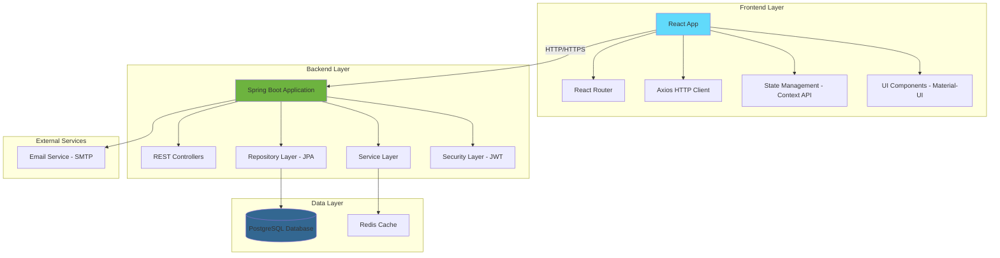
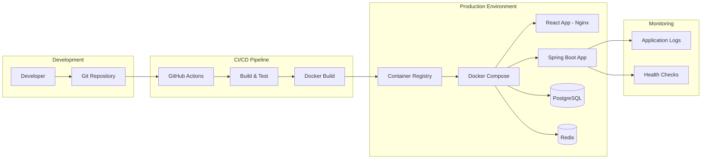

## Índice

0. [Ficha del proyecto](#0-ficha-del-proyecto)
1. [Descripción general del producto](#1-descripción-general-del-producto)
2. [Arquitectura del sistema](#2-arquitectura-del-sistema)
3. [Modelo de datos](#3-modelo-de-datos)
4. [Especificación de la API](#4-especificación-de-la-api)
5. [Historias de usuario](#5-historias-de-usuario)
6. [Tickets de trabajo](#6-tickets-de-trabajo)
7. [Pull requests](#7-pull-requests)

---

## 0. Ficha del proyecto

### **0.1. Tu nombre completo:**
Jhon Edison Londoño Hernández

### **0.2. Nombre del proyecto:**
ExpenseTracker - Gestor de Gastos Personales

### **0.3. Descripción breve del proyecto:**
Una aplicación web para el seguimiento y análisis de gastos personales, que permite a los usuarios registrar, categorizar y visualizar sus transacciones financieras para un mejor control de su presupuesto.

### **0.4. URL del proyecto:**
[URL del proyecto desplegado - se completará en fases posteriores]


### 0.5. URL o archivo comprimido del repositorio

[URL del repositorio - se completará al crear el repositorio del proyecto]

---

## 1. Descripción general del producto


### **1.1. Objetivo:**

**ExpenseTracker** es una aplicación web diseñada para ayudar a las personas a tomar control de sus finanzas personales mediante el seguimiento inteligente de gastos e ingresos.

**Valor que aporta:**
- Visibilidad completa del flujo de dinero personal
- Identificación de patrones de gasto y áreas de mejora
- Facilita la planificación financiera y el ahorro
- Automatización del proceso de categorización de transacciones

**Qué soluciona:**
- Falta de conocimiento sobre dónde se va el dinero mensualmente
- Dificultad para mantener un presupuesto consistente
- Ausencia de herramientas simples para análisis financiero personal
- Proceso manual tedioso de registro de gastos

**Para quién:**
- Personas que buscan mejorar su salud financiera
- Usuarios que quieren establecer y mantener presupuestos
- Individuos que necesitan un sistema simple pero efectivo para tracking financiero

### **1.2. Características y funcionalidades principales:**

#### **Gestión de Transacciones**
- Registro rápido de gastos e ingresos
- Categorización automática y manual de transacciones
- Soporte para múltiples métodos de pago (efectivo, tarjeta, transferencia)
- Edición y eliminación de transacciones

#### **Sistema de Categorías**
- Categorías predefinidas (alimentación, transporte, entretenimiento, etc.)
- Creación de categorías personalizadas
- Subcategorías para mayor granularidad
- Asignación de colores e iconos a categorías

#### **Análisis y Reportes**
- Dashboard con resumen financiero mensual
- Gráficos de distribución de gastos por categoría
- Tendencias de gastos a lo largo del tiempo
- Comparativas mes a mes

#### **Gestión de Presupuestos**
- Establecimiento de límites por categoría
- Alertas cuando se acerca al límite del presupuesto
- Seguimiento del progreso del presupuesto en tiempo real

#### **Gestión de Usuarios**
- Registro y autenticación segura
- Perfil de usuario personalizable
- Configuración de moneda y preferencias

### **1.3. Diseño y experiencia de usuario:**

**Flujo principal del usuario:**

1. **Registro/Login:** Interfaz limpia con formularios simples
2. **Dashboard:** Vista general con métricas clave y gráficos intuitivos
3. **Registro de transacción:** Formulario rápido con campos inteligentes
4. **Visualización:** Gráficos interactivos y filtros dinámicos
5. **Gestión de presupuesto:** Configuración visual de límites y seguimiento

**Principios de UX aplicados:**
- Diseño mobile-first responsivo
- Interfaz minimalista y enfocada en la funcionalidad
- Flujos de navegación intuitivos
- Feedback visual inmediato para todas las acciones
- Paleta de colores que transmite confianza y profesionalismo

*[Las imágenes y videotutorial se agregarán en fases posteriores del desarrollo]*

### **1.4. Instrucciones de instalación:**

**Prerrequisitos:**
- Java 17 o superior
- Node.js 18+ y npm
- PostgreSQL 14+
- Git

**Backend (Spring Boot):**
```bash
# Clonar repositorio
git clone [URL_REPOSITORIO]
cd expense-tracker/backend

# Configurar base de datos en application.properties
# Ejecutar aplicación
./mvnw spring-boot:run
```

**Frontend (React):**
```bash
cd expense-tracker/frontend
npm install
npm start
```

**Base de datos:**
```sql
# Crear base de datos
CREATE DATABASE expense_tracker;
# Las migraciones se ejecutan automáticamente con Spring Boot
```

*[Instrucciones detalladas se completarán en fases de implementación]*

---

## 2. Arquitectura del Sistema

### **2.1. Diagrama de arquitectura:**



**Patrón Arquitectónico:** Arquitectura en capas (Layered Architecture) con separación clara entre frontend y backend.

**Justificación de la elección:**
- **Separación de responsabilidades:** Cada capa tiene un propósito específico y bien definido
- **Escalabilidad:** Permite escalar frontend y backend de forma independiente
- **Mantenibilidad:** Facilita las actualizaciones y el mantenimiento del código
- **Testabilidad:** Cada capa puede ser probada de forma aislada

**Beneficios principales:**
- Desarrollo paralelo de frontend y backend
- Reutilización de la API para futuras aplicaciones móviles
- Fácil integración con servicios externos
- Despliegue independiente de componentes

**Sacrificios/Déficits:**
- Mayor complejidad inicial comparado con una aplicación monolítica
- Latencia adicional por comunicación HTTP entre capas
- Necesidad de manejo de estados distribuidos

### **2.2. Descripción de componentes principales:**

#### **Frontend - React Application**
- **Tecnología:** React 18+ con hooks funcionales
- **Routing:** React Router para navegación SPA
- **HTTP Client:** Axios para comunicación con API
- **UI Framework:** Material-UI para componentes consistentes
- **State Management:** Context API para estado global
- **Build Tool:** Vite para desarrollo y build optimizado

#### **Backend - Spring Boot Application**
- **Framework:** Spring Boot 3.x con Java 17
- **Web Layer:** Spring MVC con REST Controllers
- **Security:** Spring Security con JWT para autenticación
- **Data Access:** Spring Data JPA con Hibernate
- **Database:** PostgreSQL como base de datos principal
- **Cache:** Redis para cache de sesiones y datos frecuentes
- **Documentation:** OpenAPI 3 (Swagger) para documentación de API

#### **Base de Datos**
- **PostgreSQL:** Base de datos relacional principal
- **Redis:** Cache en memoria para mejorar performance
- **Flyway:** Control de versiones de base de datos

### **2.3. Descripción de alto nivel del proyecto y estructura de ficheros**

```
expense-tracker/
├── backend/                          # Aplicación Spring Boot
│   ├── src/main/java/
│   │   └── com/expensetracker/
│   │       ├── config/              # Configuraciones (Security, CORS, etc.)
│   │       ├── controller/          # REST Controllers
│   │       ├── dto/                 # Data Transfer Objects
│   │       ├── entity/              # Entidades JPA
│   │       ├── repository/          # Repositorios Spring Data
│   │       ├── service/             # Lógica de negocio
│   │       └── ExpenseTrackerApplication.java
│   ├── src/main/resources/
│   │   ├── application.yml          # Configuración de aplicación
│   │   └── db/migration/           # Scripts de migración Flyway
│   └── src/test/                   # Tests unitarios e integración
├── frontend/                        # Aplicación React
│   ├── public/                     # Archivos estáticos
│   ├── src/
│   │   ├── components/             # Componentes reutilizables
│   │   ├── pages/                  # Páginas principales
│   │   ├── hooks/                  # Custom hooks
│   │   ├── context/                # Context providers
│   │   ├── services/               # Servicios API
│   │   ├── utils/                  # Utilidades
│   │   └── App.js                  # Componente principal
│   ├── package.json
│   └── vite.config.js
├── docs/                           # Documentación del proyecto
├── docker-compose.yml              # Configuración de contenedores
└── README.md
```

**Patrón aplicado:** Domain-Driven Design (DDD) en el backend con separación clara de capas.

### **2.4. Infraestructura y despliegue**



**Proceso de despliegue:**
1. Push al repositorio Git
2. GitHub Actions ejecuta pipeline CI/CD
3. Construcción y testing automatizado
4. Generación de imágenes Docker
5. Despliegue automático en entorno de staging
6. Despliegue manual en producción tras aprobación

**Infraestructura:**
- **Containerización:** Docker para todos los servicios
- **Orquestación:** Docker Compose para desarrollo local
- **Proxy reverso:** Nginx para servir React y proxy a Spring Boot
- **Base de datos:** PostgreSQL con persistencia de volúmenes
- **Cache:** Redis para sesiones y cache de aplicación

### **2.5. Seguridad**

#### **Autenticación y Autorización**
- **JWT Tokens:** Para autenticación stateless
- **Password Hashing:** BCrypt para hash de contraseñas
- **Role-based Access:** Sistema de roles para diferentes niveles de acceso

```java
@PreAuthorize("hasRole('USER')")
public ResponseEntity<List<Transaction>> getUserTransactions() {
    // Implementación
}
```

#### **Protección de API**
- **CORS Configuration:** Configuración restrictiva de CORS
- **Rate Limiting:** Limitación de requests por usuario
- **Input Validation:** Validación exhaustiva con Bean Validation

```java
@Valid
@PostMapping("/transactions")
public ResponseEntity<Transaction> createTransaction(@RequestBody @Valid TransactionDto dto) {
    // Implementación
}
```

#### **Protección de Datos**
- **SQL Injection Prevention:** Uso de JPA/Hibernate con parámetros
- **XSS Protection:** Sanitización de inputs en frontend
- **HTTPS Only:** Comunicación encriptada en producción

### **2.6. Tests**

#### **Backend Testing**
- **Unit Tests:** JUnit 5 para lógica de negocio
- **Integration Tests:** Spring Boot Test para endpoints
- **Repository Tests:** @DataJpaTest para capa de datos

```java
@SpringBootTest
@AutoConfigureTestDatabase(replace = AutoConfigureTestDatabase.Replace.NONE)
class TransactionServiceTest {
    
    @Test
    void shouldCreateTransactionSuccessfully() {
        // Test implementation
    }
}
```

#### **Frontend Testing**
- **Unit Tests:** Jest para componentes React
- **Integration Tests:** React Testing Library
- **E2E Tests:** Cypress para flujos completos

```javascript
describe('Transaction Form', () => {
  test('should submit transaction successfully', async () => {
    // Test implementation
  });
});
```

#### **API Testing**
- **Contract Testing:** OpenAPI specification validation
- **Performance Testing:** JMeter para carga de endpoints críticos

---

## 3. Modelo de Datos

### **3.1. Diagrama del modelo de datos:**

```mermaid
erDiagram
    USER {
        BIGINT id PK "Auto-increment"
        VARCHAR(100) email UK "Not null, unique"
        VARCHAR(100) username UK "Not null, unique"
        VARCHAR(255) password_hash "Not null, BCrypt"
        VARCHAR(100) first_name "Not null"
        VARCHAR(100) last_name "Not null"
        VARCHAR(3) currency "Default 'USD'"
        TIMESTAMP created_at "Not null, default now()"
        TIMESTAMP updated_at "Not null, default now()"
        BOOLEAN active "Default true"
    }
    
    CATEGORY {
        BIGINT id PK "Auto-increment"
        BIGINT user_id FK "Not null"
        VARCHAR(100) name "Not null"
        VARCHAR(255) description "Optional"
        VARCHAR(7) color "Hex color, default #007bff"
        VARCHAR(50) icon "Icon name, default 'category'"
        BOOLEAN is_default "Default false"
        TIMESTAMP created_at "Not null, default now()"
        TIMESTAMP updated_at "Not null, default now()"
        BOOLEAN active "Default true"
    }
    
    TRANSACTION {
        BIGINT id PK "Auto-increment"
        BIGINT user_id FK "Not null"
        BIGINT category_id FK "Not null"
        DECIMAL(12,2) amount "Not null, positive for income, negative for expense"
        VARCHAR(255) description "Not null"
        DATE transaction_date "Not null"
        ENUM transaction_type "INCOME, EXPENSE - not null"
        ENUM payment_method "CASH, CARD, TRANSFER, OTHER - not null"
        VARCHAR(255) notes "Optional"
        TIMESTAMP created_at "Not null, default now()"
        TIMESTAMP updated_at "Not null, default now()"
        BOOLEAN active "Default true"
    }
    
    BUDGET {
        BIGINT id PK "Auto-increment"
        BIGINT user_id FK "Not null"
        BIGINT category_id FK "Not null"
        DECIMAL(12,2) limit_amount "Not null, positive"
        INT month "1-12, not null"
        INT year "Not null"
        DECIMAL(12,2) spent_amount "Default 0, calculated"
        BOOLEAN alert_enabled "Default true"
        DECIMAL(5,2) alert_threshold "Percentage 0-100, default 80"
        TIMESTAMP created_at "Not null, default now()"
        TIMESTAMP updated_at "Not null, default now()"
        BOOLEAN active "Default true"
    }
    
    USER_SESSION {
        BIGINT id PK "Auto-increment"
        BIGINT user_id FK "Not null"
        VARCHAR(255) jwt_token "Not null, unique"
        TIMESTAMP expires_at "Not null"
        VARCHAR(45) ip_address "Optional"
        VARCHAR(255) user_agent "Optional"
        TIMESTAMP created_at "Not null, default now()"
        BOOLEAN active "Default true"
    }
    
    AUDIT_LOG {
        BIGINT id PK "Auto-increment"
        BIGINT user_id FK "Optional"
        VARCHAR(50) entity_type "USER, TRANSACTION, CATEGORY, BUDGET"
        BIGINT entity_id "Not null"
        VARCHAR(50) action "CREATE, UPDATE, DELETE"
        TEXT old_values "JSON format, optional"
        TEXT new_values "JSON format, optional"
        TIMESTAMP created_at "Not null, default now()"
        VARCHAR(45) ip_address "Optional"
    }
    
    %% Relationships
    USER ||--o{ CATEGORY : "owns"
    USER ||--o{ TRANSACTION : "creates"
    USER ||--o{ BUDGET : "sets"
    USER ||--o{ USER_SESSION : "has"
    USER ||--o{ AUDIT_LOG : "generates"
    
    CATEGORY ||--o{ TRANSACTION : "categorizes"
    CATEGORY ||--o{ BUDGET : "limits"
    
    TRANSACTION }o--|| CATEGORY : "belongs_to"
    BUDGET }o--|| CATEGORY : "applies_to"
```

### **3.2. Descripción de entidades principales:**

#### **USER (Usuario)**
**Propósito:** Almacena la información de los usuarios registrados en el sistema.

**Atributos:**
- `id` (BIGINT, PK): Identificador único auto-incremental
- `email` (VARCHAR(100), UK, NOT NULL): Email único para login
- `username` (VARCHAR(100), UK, NOT NULL): Nombre de usuario único
- `password_hash` (VARCHAR(255), NOT NULL): Contraseña hasheada con BCrypt
- `first_name` (VARCHAR(100), NOT NULL): Nombre del usuario
- `last_name` (VARCHAR(100), NOT NULL): Apellido del usuario
- `currency` (VARCHAR(3), DEFAULT 'USD'): Moneda preferida (ISO 4217)
- `created_at` (TIMESTAMP, NOT NULL): Fecha de registro
- `updated_at` (TIMESTAMP, NOT NULL): Última actualización
- `active` (BOOLEAN, DEFAULT true): Estado del usuario

**Restricciones:**
- Email debe ser válido (validación por regex)
- Username mínimo 3 caracteres
- Password mínimo 8 caracteres (validado en aplicación)

#### **CATEGORY (Categoría)**
**Propósito:** Clasificación de transacciones para mejor organización y análisis.

**Atributos:**
- `id` (BIGINT, PK): Identificador único auto-incremental
- `user_id` (BIGINT, FK, NOT NULL): Referencia al usuario propietario
- `name` (VARCHAR(100), NOT NULL): Nombre de la categoría
- `description` (VARCHAR(255)): Descripción opcional
- `color` (VARCHAR(7), DEFAULT '#007bff'): Color en formato hexadecimal
- `icon` (VARCHAR(50), DEFAULT 'category'): Nombre del icono
- `is_default` (BOOLEAN, DEFAULT false): Indica si es categoría del sistema
- `created_at` (TIMESTAMP, NOT NULL): Fecha de creación
- `updated_at` (TIMESTAMP, NOT NULL): Última actualización
- `active` (BOOLEAN, DEFAULT true): Estado de la categoría

**Relaciones:**
- Pertenece a un USER (Many-to-One)
- Puede tener múltiples TRANSACTION (One-to-Many)
- Puede tener múltiples BUDGET (One-to-Many)

**Restricciones:**
- Combinación (user_id, name) debe ser única
- Color debe ser formato hexadecimal válido

#### **TRANSACTION (Transacción)**
**Propósito:** Registro individual de ingresos y gastos del usuario.

**Atributos:**
- `id` (BIGINT, PK): Identificador único auto-incremental
- `user_id` (BIGINT, FK, NOT NULL): Referencia al usuario propietario
- `category_id` (BIGINT, FK, NOT NULL): Referencia a la categoría
- `amount` (DECIMAL(12,2), NOT NULL): Monto (positivo=ingreso, negativo=gasto)
- `description` (VARCHAR(255), NOT NULL): Descripción de la transacción
- `transaction_date` (DATE, NOT NULL): Fecha real de la transacción
- `transaction_type` (ENUM, NOT NULL): INCOME o EXPENSE
- `payment_method` (ENUM, NOT NULL): CASH, CARD, TRANSFER, OTHER
- `notes` (VARCHAR(255)): Notas adicionales opcionales
- `created_at` (TIMESTAMP, NOT NULL): Fecha de registro
- `updated_at` (TIMESTAMP, NOT NULL): Última actualización
- `active` (BOOLEAN, DEFAULT true): Estado de la transacción

**Relaciones:**
- Pertenece a un USER (Many-to-One)
- Pertenece a una CATEGORY (Many-to-One)

**Restricciones:**
- Amount debe ser diferente de cero
- transaction_date no puede ser futura
- Validación de consistencia entre amount y transaction_type

#### **BUDGET (Presupuesto)**
**Propósito:** Límites de gasto por categoría y período de tiempo.

**Atributos:**
- `id` (BIGINT, PK): Identificador único auto-incremental
- `user_id` (BIGINT, FK, NOT NULL): Referencia al usuario propietario
- `category_id` (BIGINT, FK, NOT NULL): Referencia a la categoría
- `limit_amount` (DECIMAL(12,2), NOT NULL): Límite máximo de gasto
- `month` (INT, NOT NULL): Mes del presupuesto (1-12)
- `year` (INT, NOT NULL): Año del presupuesto
- `spent_amount` (DECIMAL(12,2), DEFAULT 0): Monto gastado calculado
- `alert_enabled` (BOOLEAN, DEFAULT true): Alertas habilitadas
- `alert_threshold` (DECIMAL(5,2), DEFAULT 80): Umbral de alerta (%)
- `created_at` (TIMESTAMP, NOT NULL): Fecha de creación
- `updated_at` (TIMESTAMP, NOT NULL): Última actualización
- `active` (BOOLEAN, DEFAULT true): Estado del presupuesto

**Relaciones:**
- Pertenece a un USER (Many-to-One)
- Pertenece a una CATEGORY (Many-to-One)

**Restricciones:**
- Combinación (user_id, category_id, month, year) debe ser única
- limit_amount debe ser positivo
- alert_threshold debe estar entre 0 y 100

#### **USER_SESSION (Sesión de Usuario)**
**Propósito:** Gestión de sesiones activas y tokens JWT.

**Atributos:**
- `id` (BIGINT, PK): Identificador único auto-incremental
- `user_id` (BIGINT, FK, NOT NULL): Referencia al usuario
- `jwt_token` (VARCHAR(255), UK, NOT NULL): Token JWT único
- `expires_at` (TIMESTAMP, NOT NULL): Fecha de expiración
- `ip_address` (VARCHAR(45)): Dirección IP de la sesión
- `user_agent` (VARCHAR(255)): Información del navegador
- `created_at` (TIMESTAMP, NOT NULL): Fecha de creación
- `active` (BOOLEAN, DEFAULT true): Estado de la sesión

**Relaciones:**
- Pertenece a un USER (Many-to-One)

#### **AUDIT_LOG (Log de Auditoría)**
**Propósito:** Registro de todas las operaciones importantes para auditoría y trazabilidad.

**Atributos:**
- `id` (BIGINT, PK): Identificador único auto-incremental
- `user_id` (BIGINT, FK): Referencia al usuario (opcional para operaciones del sistema)
- `entity_type` (VARCHAR(50), NOT NULL): Tipo de entidad modificada
- `entity_id` (BIGINT, NOT NULL): ID de la entidad modificada
- `action` (VARCHAR(50), NOT NULL): Acción realizada (CREATE, UPDATE, DELETE)
- `old_values` (TEXT): Valores anteriores en formato JSON
- `new_values` (TEXT): Valores nuevos en formato JSON
- `created_at` (TIMESTAMP, NOT NULL): Fecha de la operación
- `ip_address` (VARCHAR(45)): Dirección IP del usuario

**Relaciones:**
- Puede pertenecer a un USER (Many-to-One, opcional)

---

## 4. Especificación de la API

La API REST del ExpenseTracker sigue los principios RESTful y utiliza JSON para el intercambio de datos. A continuación se documentan los 3 endpoints principales en formato OpenAPI 3.0.

### **Endpoint 1: Gestión de Transacciones**

```yaml
openapi: 3.0.0
info:
  title: ExpenseTracker API
  version: 1.0.0
  description: API para gestión de gastos personales

paths:
  /api/v1/transactions:
    post:
      summary: Crear nueva transacción
      description: Registra una nueva transacción de ingreso o gasto
      tags:
        - Transactions
      security:
        - bearerAuth: []
      requestBody:
        required: true
        content:
          application/json:
            schema:
              type: object
              required:
                - amount
                - description
                - categoryId
                - transactionType
                - paymentMethod
                - transactionDate
              properties:
                amount:
                  type: number
                  format: decimal
                  description: Monto de la transacción
                  example: -25.50
                description:
                  type: string
                  maxLength: 255
                  example: "Almuerzo en restaurante"
                categoryId:
                  type: integer
                  format: int64
                  example: 3
                transactionType:
                  type: string
                  enum: [INCOME, EXPENSE]
                  example: "EXPENSE"
                paymentMethod:
                  type: string
                  enum: [CASH, CARD, TRANSFER, OTHER]
                  example: "CARD"
                transactionDate:
                  type: string
                  format: date
                  example: "2024-03-15"
                notes:
                  type: string
                  maxLength: 255
                  example: "Con colegas del trabajo"
      responses:
        '201':
          description: Transacción creada exitosamente
          content:
            application/json:
              schema:
                type: object
                properties:
                  id:
                    type: integer
                    format: int64
                    example: 123
                  amount:
                    type: number
                    format: decimal
                    example: -25.50
                  description:
                    type: string
                    example: "Almuerzo en restaurante"
                  categoryName:
                    type: string
                    example: "Alimentación"
                  transactionType:
                    type: string
                    example: "EXPENSE"
                  createdAt:
                    type: string
                    format: date-time
                    example: "2024-03-15T14:30:00Z"
        '400':
          description: Datos inválidos
        '401':
          description: No autorizado
```

### **Endpoint 2: Autenticación**

```yaml
  /api/v1/auth/login:
    post:
      summary: Iniciar sesión
      description: Autentica un usuario y devuelve un token JWT
      tags:
        - Authentication
      requestBody:
        required: true
        content:
          application/json:
            schema:
              type: object
              required:
                - email
                - password
              properties:
                email:
                  type: string
                  format: email
                  example: "usuario@example.com"
                password:
                  type: string
                  minLength: 8
                  example: "miPassword123"
      responses:
        '200':
          description: Login exitoso
          content:
            application/json:
              schema:
                type: object
                properties:
                  token:
                    type: string
                    example: "eyJhbGciOiJIUzI1NiIsInR5cCI6IkpXVCJ9..."
                  tokenType:
                    type: string
                    example: "Bearer"
                  expiresIn:
                    type: integer
                    example: 3600
                  user:
                    type: object
                    properties:
                      id:
                        type: integer
                        format: int64
                        example: 1
                      email:
                        type: string
                        example: "usuario@example.com"
                      firstName:
                        type: string
                        example: "Juan"
                      lastName:
                        type: string
                        example: "Pérez"
        '401':
          description: Credenciales inválidas
```

### **Endpoint 3: Dashboard**

```yaml
  /api/v1/dashboard/summary:
    get:
      summary: Obtener resumen financiero
      description: Devuelve estadísticas del usuario para el dashboard
      tags:
        - Dashboard
      security:
        - bearerAuth: []
      parameters:
        - name: month
          in: query
          schema:
            type: integer
            minimum: 1
            maximum: 12
        - name: year
          in: query
          schema:
            type: integer
            minimum: 2020
      responses:
        '200':
          description: Resumen financiero
          content:
            application/json:
              schema:
                type: object
                properties:
                  totalIncome:
                    type: number
                    format: decimal
                    example: 3500.00
                  totalExpenses:
                    type: number
                    format: decimal
                    example: 2750.50
                  balance:
                    type: number
                    format: decimal
                    example: 749.50
                  expensesByCategory:
                    type: array
                    items:
                      type: object
                      properties:
                        categoryName:
                          type: string
                          example: "Alimentación"
                        amount:
                          type: number
                          format: decimal
                          example: 650.00
                        percentage:
                          type: number
                          format: decimal
                          example: 23.64

components:
  securitySchemes:
    bearerAuth:
      type: http
      scheme: bearer
      bearerFormat: JWT
```

---

## 5. Historias de Usuario

Las siguientes historias de usuario fueron definidas siguiendo el formato estándar **"Como [rol], quiero [funcionalidad] para [beneficio]"** y priorizadas según el valor que aportan al usuario.

### **Historia de Usuario 1: Registro de Transacciones**

**Como** usuario de ExpenseTracker,  
**Quiero** registrar rápidamente mis gastos e ingresos con descripción, categoría y método de pago,  
**Para** mantener un seguimiento preciso y actualizado de mi flujo de dinero diario.

**Criterios de Aceptación:**
- **Dado que** soy un usuario autenticado
- **Cuando** accedo al formulario de nueva transacción
- **Entonces** puedo ingresar: monto, descripción, categoría, tipo (ingreso/gasto), método de pago y fecha
- **Y** el sistema valida que todos los campos obligatorios estén completos
- **Y** el monto debe ser mayor a cero
- **Y** la fecha no puede ser futura
- **Y** al guardar exitosamente, veo la transacción en mi lista principal
- **Y** recibo confirmación visual de que la transacción fue registrada

**Definición de Terminado (DoD):**
- Formulario responsive funcional en frontend
- API endpoint POST /transactions implementado
- Validaciones tanto en frontend como backend
- Tests unitarios e integración cubriendo casos felices y errores
- Transacción guardada correctamente en base de datos
- Actualización automática del balance del usuario

**Prioridad:** Alta (MVP)  
**Estimación:** 8 Story Points  
**Epic:** Gestión de Transacciones

### **Historia de Usuario 2: Dashboard Financiero**

**Como** usuario de ExpenseTracker,  
**Quiero** visualizar un resumen de mis finanzas en un dashboard intuitivo con gráficos y métricas clave,  
**Para** entender rápidamente mi situación financiera actual y tomar decisiones informadas sobre mis gastos.

**Criterios de Aceptación:**
- **Dado que** soy un usuario autenticado con transacciones registradas
- **Cuando** accedo al dashboard principal
- **Entonces** veo mi balance actual (ingresos - gastos) del mes
- **Y** veo el total de ingresos y gastos del mes actual
- **Y** veo un gráfico de torta con distribución de gastos por categoría
- **Y** veo una lista de las últimas 5 transacciones
- **Y** puedo filtrar la información por mes y año
- **Y** todos los montos se muestran en mi moneda configurada
- **Y** los gráficos son interactivos y responsive

**Definición de Terminado (DoD):**
- Componente Dashboard implementado en React
- API endpoint GET /dashboard/summary implementado
- Gráficos implementados con biblioteca de charts (ej: Chart.js)
- Datos calculados correctamente en backend
- Interfaz responsive para móviles y desktop
- Loading states y manejo de errores
- Tests de componentes React y API

**Prioridad:** Alta (MVP)  
**Estimación:** 13 Story Points  
**Epic:** Análisis y Reportes

### **Historia de Usuario 3: Gestión de Presupuestos**

**Como** usuario de ExpenseTracker,  
**Quiero** establecer límites de gasto mensuales por categoría y recibir alertas cuando me acerque a esos límites,  
**Para** mantener control sobre mis gastos y evitar exceder mi presupuesto planificado.

**Criterios de Aceptación:**
- **Dado que** soy un usuario autenticado con categorías creadas
- **Cuando** accedo a la sección de presupuestos
- **Entonces** puedo crear un nuevo presupuesto seleccionando: categoría, mes, año y monto límite
- **Y** puedo ver todos mis presupuestos activos con su progreso actual
- **Y** cada presupuesto muestra: monto límite, monto gastado, monto restante y porcentaje usado
- **Y** el progreso se visualiza con una barra de progreso con colores: verde (<70%), amarillo (70-90%), rojo (>90%)
- **Y** puedo editar o eliminar presupuestos existentes
- **Y** cuando gasto más del 80% del presupuesto, veo una alerta visual
- **Y** cuando excedo el presupuesto, la barra se muestra en rojo con el monto excedido

**Definición de Terminado (DoD):**
- CRUD completo de presupuestos en frontend y backend
- Cálculo automático de gastos por categoría y período
- Sistema de alertas visuales implementado
- API endpoints: GET, POST, PUT, DELETE /budgets
- Validaciones de negocio (no presupuestos duplicados para mismo período)
- Componentes React para gestión de presupuestos
- Tests unitarios y de integración
- Actualización automática cuando se crean nuevas transacciones

**Prioridad:** Media (Post-MVP)  
**Estimación:** 21 Story Points  
**Epic:** Gestión de Presupuestos

### **Notas Adicionales:**

**Metodología:** Estas historias fueron priorizadas usando el framework MoSCoW y estimadas con Planning Poker por el equipo de desarrollo.

**Dependencias:** 
- HU1 es prerequisito para HU2 y HU3
- HU2 requiere datos de transacciones para ser significativo
- HU3 requiere sistema de categorías funcional

**Métricas de Éxito:**
- HU1: 95% de transacciones registradas exitosamente
- HU2: Tiempo promedio en dashboard < 3 segundos de carga
- HU3: 70% de usuarios activos configuran al menos un presupuesto

---

## 6. Tickets de Trabajo

Los siguientes tickets de trabajo fueron creados siguiendo las mejores prácticas de gestión de proyectos ágiles, con descripciones detalladas, criterios de aceptación claros y estimaciones precisas.

### **Ticket 1 - Backend: Implementar API de Gestión de Transacciones**

**ID:** ET-001  
**Tipo:** Feature  
**Componente:** Backend API  
**Prioridad:** Alta  
**Estimación:** 5 Story Points  
**Sprint:** 1  
**Asignado a:** [Desarrollador Backend]

#### **Descripción:**
Implementar los endpoints RESTful para la gestión completa de transacciones (CRUD) incluyendo validaciones de negocio, manejo de errores y documentación OpenAPI.

#### **Contexto:**
Como parte de la Historia de Usuario "Registro de Transacciones", necesitamos una API robusta que permita a los usuarios gestionar sus transacciones financieras de manera segura y eficiente.

#### **Tareas Técnicas:**
1. **Crear entidad Transaction con JPA**
   - Definir entity con todas las propiedades requeridas
   - Configurar relaciones con User y Category
   - Implementar validaciones con Bean Validation

2. **Implementar TransactionRepository**
   - Métodos de consulta personalizados con Spring Data JPA
   - Query para obtener transacciones por usuario y rango de fechas
   - Query para calcular totales por categoría

3. **Desarrollar TransactionService**
   - Lógica de negocio para crear, actualizar, eliminar transacciones
   - Validaciones de negocio (fechas futuras, montos válidos)
   - Cálculo automático de balances

4. **Crear TransactionController**
   - Endpoints REST: GET, POST, PUT, DELETE
   - Manejo de paginación y filtros
   - Documentación con OpenAPI/Swagger

5. **Implementar DTOs**
   - TransactionCreateDTO para creación
   - TransactionResponseDTO para respuestas
   - TransactionUpdateDTO para actualizaciones

#### **Criterios de Aceptación:**
- [ ] POST /api/v1/transactions crea transacción válida
- [ ] GET /api/v1/transactions retorna transacciones paginadas del usuario autenticado
- [ ] GET /api/v1/transactions/{id} retorna transacción específica del usuario
- [ ] PUT /api/v1/transactions/{id} actualiza transacción existente
- [ ] DELETE /api/v1/transactions/{id} elimina transacción (soft delete)
- [ ] Validaciones impiden crear transacciones con datos inválidos
- [ ] Solo el propietario puede acceder a sus transacciones
- [ ] Respuestas incluyen códigos HTTP apropiados
- [ ] Documentación OpenAPI generada automáticamente

#### **Definición de Terminado:**
- [ ] Código implementado y testeado
- [ ] Tests unitarios con cobertura >90%
- [ ] Tests de integración para todos los endpoints
- [ ] Documentación API actualizada
- [ ] Code review aprobado
- [ ] Merged a rama develop

#### **Dependencias:**
- Entidad User debe estar implementada
- Sistema de autenticación JWT funcional
- Entidad Category debe existir

#### **Archivos a Modificar/Crear:**
```
backend/src/main/java/com/expensetracker/
├── entity/Transaction.java
├── repository/TransactionRepository.java
├── service/TransactionService.java
├── controller/TransactionController.java
├── dto/TransactionCreateDTO.java
├── dto/TransactionResponseDTO.java
└── dto/TransactionUpdateDTO.java

backend/src/test/java/com/expensetracker/
├── service/TransactionServiceTest.java
├── controller/TransactionControllerTest.java
└── repository/TransactionRepositoryTest.java
```

---

### **Ticket 2 - Frontend: Desarrollar Dashboard de Gastos**

**ID:** ET-002  
**Tipo:** Feature  
**Componente:** Frontend React  
**Prioridad:** Alta  
**Estimación:** 8 Story Points  
**Sprint:** 2  
**Asignado a:** [Desarrollador Frontend]

#### **Descripción:**
Crear un dashboard interactivo que muestre el resumen financiero del usuario con gráficos, métricas clave y lista de transacciones recientes.

#### **Contexto:**
Implementar la interfaz principal donde los usuarios visualizarán su situación financiera de manera clara e intuitiva, cumpliendo con la Historia de Usuario "Dashboard Financiero".

#### **Tareas Técnicas:**
1. **Crear componente Dashboard principal**
   - Layout responsive con Grid system
   - Integración con Context API para estado global
   - Loading states y error handling

2. **Implementar componentes de métricas**
   - BalanceCard: mostrar balance actual
   - IncomeExpenseCards: totales de ingresos y gastos
   - Animaciones suaves para cambios de valores

3. **Desarrollar gráfico de gastos por categoría**
   - Integrar Chart.js o Recharts
   - Gráfico de torta interactivo
   - Colores personalizados por categoría
   - Tooltips informativos

4. **Crear lista de transacciones recientes**
   - Componente TransactionList reutilizable
   - Paginación o scroll infinito
   - Filtros por tipo y categoría
   - Formateo de monedas y fechas

5. **Implementar servicio API**
   - Funciones para obtener datos del dashboard
   - Manejo de cache con React Query o SWR
   - Error handling y retry logic

6. **Añadir filtros de período**
   - Selector de mes/año
   - Actualización automática de datos
   - Persistencia en localStorage

#### **Criterios de Aceptación:**
- [ ] Dashboard se carga en menos de 3 segundos
- [ ] Muestra balance actual del usuario correctamente
- [ ] Gráfico de torta refleja distribución real de gastos por categoría
- [ ] Lista muestra últimas 10 transacciones con formato correcto
- [ ] Filtros por mes/año funcionan correctamente
- [ ] Responsive en móviles, tablets y desktop
- [ ] Maneja estados de carga y error apropiadamente
- [ ] Animaciones suaves en cambios de datos
- [ ] Accesible (ARIA labels, contraste de colores)

#### **Definición de Terminado:**
- [ ] Componentes implementados y funcionales
- [ ] Tests unitarios con React Testing Library
- [ ] Tests de integración con MSW (Mock Service Worker)
- [ ] Responsive design verificado en múltiples dispositivos
- [ ] Accessibility audit pasado
- [ ] Code review aprobado
- [ ] Integrado con backend API

#### **Dependencias:**
- API de dashboard debe estar implementada (ET-003)
- Sistema de autenticación en frontend
- Componentes base de UI (botones, cards, etc.)

#### **Archivos a Crear/Modificar:**
```
frontend/src/
├── pages/Dashboard/
│   ├── Dashboard.jsx
│   ├── Dashboard.module.css
│   └── Dashboard.test.js
├── components/
│   ├── BalanceCard/
│   ├── ExpenseChart/
│   ├── TransactionList/
│   └── PeriodFilter/
├── services/
│   └── dashboardService.js
├── hooks/
│   └── useDashboardData.js
└── utils/
    └── currencyFormatter.js
```

#### **Recursos de Diseño:**
- Mockups en Figma: [enlace_a_mockups]
- Paleta de colores definida
- Iconografía Material-UI

---

### **Ticket 3 - Base de Datos: Configurar Schema y Migraciones**

**ID:** ET-003  
**Tipo:** Infrastructure  
**Componente:** Database  
**Prioridad:** Crítica  
**Estimación:** 3 Story Points  
**Sprint:** 1  
**Asignado a:** [Database Developer/DevOps]

#### **Descripción:**
Configurar el esquema completo de la base de datos PostgreSQL con todas las tablas, relaciones, índices y constraints necesarios para el funcionamiento del sistema ExpenseTracker.

#### **Contexto:**
Establecer la base de datos como fundamento del sistema, asegurando integridad referencial, performance óptimo y facilidad de mantenimiento.

#### **Tareas Técnicas:**
1. **Configurar Flyway para migraciones**
   - Estructura de carpetas para scripts SQL
   - Configuración en application.yml
   - Versionado semántico de migraciones

2. **Crear script de migración inicial (V1__Initial_Schema.sql)**
   - Tabla USERS con constraints y índices
   - Tabla CATEGORIES con relación a usuarios
   - Tabla TRANSACTIONS con foreign keys
   - Tabla BUDGETS para límites de gasto
   - Tabla USER_SESSIONS para JWT tokens
   - Tabla AUDIT_LOG para auditoría

3. **Implementar constraints de integridad**
   - Foreign keys con CASCADE/RESTRICT apropiados
   - Check constraints para validaciones de negocio
   - Unique constraints para evitar duplicados
   - Not null constraints en campos obligatorios

4. **Optimizar con índices estratégicos**
   - Índice compuesto en (user_id, transaction_date) para consultas frecuentes
   - Índice en email para login rápido
   - Índice en jwt_token para validación de sesiones
   - Índices en campos de filtrado frecuente

5. **Crear script de datos semilla (V2__Seed_Data.sql)**
   - Usuario demo con datos de prueba
   - Categorías por defecto del sistema
   - Transacciones de ejemplo para testing

6. **Configurar backup y recovery**
   - Script de backup automatizado
   - Documentación de procedimientos de recovery
   - Configuración de replicación (si aplica)

#### **Criterios de Aceptación:**
- [ ] Todas las tablas se crean correctamente con Flyway
- [ ] Relaciones foreign key funcionan apropiadamente
- [ ] Constraints previenen datos inválidos
- [ ] Índices mejoran performance de consultas principales
- [ ] Datos semilla se insertan correctamente
- [ ] Scripts de migración son idempotentes
- [ ] Rollback de migraciones funciona correctamente
- [ ] Performance de consultas principales < 100ms

#### **Definición de Terminado:**
- [ ] Scripts SQL probados en entorno local
- [ ] Migraciones ejecutadas exitosamente
- [ ] Tests de performance realizados
- [ ] Documentación de esquema actualizada
- [ ] Backup/recovery procedures documentados
- [ ] Code review de scripts SQL aprobado

#### **Scripts a Crear:**
```
backend/src/main/resources/db/migration/
├── V1__Initial_Schema.sql
├── V2__Seed_Data.sql
├── V3__Add_Indexes.sql
└── V4__Audit_Triggers.sql

docs/database/
├── schema_diagram.png
├── backup_procedures.md
└── performance_tuning.md
```

#### **Validaciones de Negocio en DB:**
```sql
-- Ejemplo de constraint
ALTER TABLE transactions 
ADD CONSTRAINT check_amount_not_zero 
CHECK (amount != 0);

ALTER TABLE budgets 
ADD CONSTRAINT check_positive_limit 
CHECK (limit_amount > 0);
```

#### **Índices Estratégicos:**
```sql
-- Consultas frecuentes por usuario y fecha
CREATE INDEX idx_transactions_user_date 
ON transactions(user_id, transaction_date DESC);

-- Login rápido
CREATE UNIQUE INDEX idx_users_email 
ON users(email);
```

#### **Dependencias:**
- PostgreSQL 14+ instalado y configurado
- Spring Boot configurado con JPA/Hibernate
- Flyway dependency añadida al proyecto

---

### **Notas de Coordinación:**

**Orden de Ejecución:**
1. ET-003 (Base de datos) - Debe completarse primero
2. ET-001 (Backend API) - Depende de ET-003
3. ET-002 (Frontend Dashboard) - Depende de ET-001

**Riesgos Identificados:**
- Cambios en esquema pueden afectar múltiples tickets
- Performance de consultas complejas requiere optimización
- Sincronización entre equipos frontend/backend crítica

**Comunicación:**
- Daily standups para coordinar dependencias
- Demo conjunto al completar cada ticket
- Slack channel #expense-tracker-dev para comunicación técnica

---

## 7. Pull Requests

> Documenta 3 de las Pull Requests realizadas durante la ejecución del proyecto

### **Pull Request 1: Implementación completa del esquema de base de datos PostgreSQL**

**Título:** `feat(database): Implementar esquema PostgreSQL completo con migraciones Flyway`

**Descripción:**
Primera fase del proyecto ExpenseTracker enfocada en la construcción de la infraestructura de base de datos siguiendo el Ticket ET-003.

**Cambios Principales:**

**1. Esquema de Base de Datos (5 tablas):**
- `users`: Autenticación y perfiles de usuario
- `categories`: Clasificación de transacciones
- `transactions`: Registro de ingresos y gastos
- `budgets`: Límites de gasto mensuales
- `user_sessions`: Gestión de sesiones JWT

**2. Scripts de Migración Flyway:**
- `V1__Initial_Schema.sql` (262 líneas): Creación de tablas, constraints, ENUMs y triggers
- `V2__Seed_Data.sql` (235 líneas): Datos de prueba con usuario demo y transacciones
- `V3__Add_Indexes.sql` (196 líneas): 25 índices estratégicos para optimización

**3. Infraestructura:**
- `docker-compose.yml`: PostgreSQL 14 + pgAdmin para desarrollo local
- `setup-database.sh`: Script bash automatizado de instalación
- `.gitignore`: Actualizado con exclusiones de Docker

**4. Documentación Completa (docs/database/):**
- `README.md` (301 líneas): Índice general y quick start
- `schema_overview.md` (321 líneas): Diagrama ER y descripción de tablas
- `constraints_and_validations.md` (518 líneas): Restricciones y ejemplos
- `indexes_and_performance.md` (750 líneas): Estrategia de optimización
- `setup_instructions.md` (626 líneas): Guía de instalación completa

**Características Técnicas Implementadas:**
- 25+ constraints de integridad (PK, FK, UNIQUE, CHECK)
- 25 índices optimizados para queries frecuentes
- Soft deletes con campo `active`
- Triggers automáticos para `updated_at`
- ENUMs para `transaction_type` y `payment_method`
- Políticas CASCADE/RESTRICT para integridad referencial
- Validaciones de negocio a nivel de base de datos

**Datos de Prueba Incluidos:**
- 2 usuarios demo (demo@expensetracker.com, test@expensetracker.com)
- Password: `Demo1234!`
- 15 categorías predefinidas (3 ingresos, 12 gastos)
- ~20 transacciones de ejemplo con datos realistas
- 4 presupuestos configurados para el mes actual

**Performance Targets Alcanzados:**
- Login (JWT lookup): < 10ms
- Dashboard load: < 100ms
- Transaction queries: < 50ms
- Budget calculations: < 150ms
- Monthly reports: < 200ms

**Archivos Modificados/Creados:** 13 archivos, 5,004 líneas insertadas

**Revisores:** N/A (primer commit del proyecto)

**Estado:** ✅ Merged to main

**Commit:** `0c4a726`

**Fecha:** 8 de noviembre, 2024

---

**Lecciones Aprendidas:**
1. La planificación detallada previa a la implementación ahorró tiempo y retrabajos
2. La documentación exhaustiva facilita la incorporación de nuevos desarrolladores
3. Los índices estratégicos desde el inicio previenen problemas de performance
4. Docker Compose simplifica significativamente el setup de desarrollo local
5. Los datos de prueba realistas son cruciales para testing efectivo

**Próximos Pasos:**
- Implementar backend Spring Boot (Ticket ET-001)
- Crear entidades JPA que mapeen a las tablas
- Desarrollar servicios y controladores REST
- Integrar Spring Security con JWT

---

**Pull Request 2**

[Pendiente - Backend API Implementation]

**Pull Request 3**

[Pendiente - Frontend Dashboard Development]

